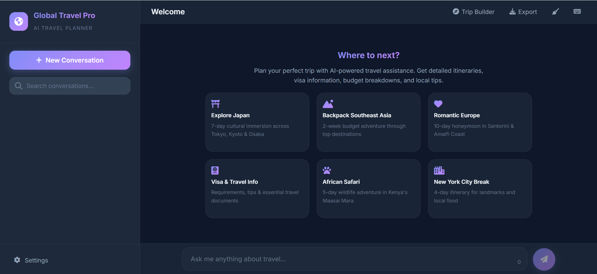
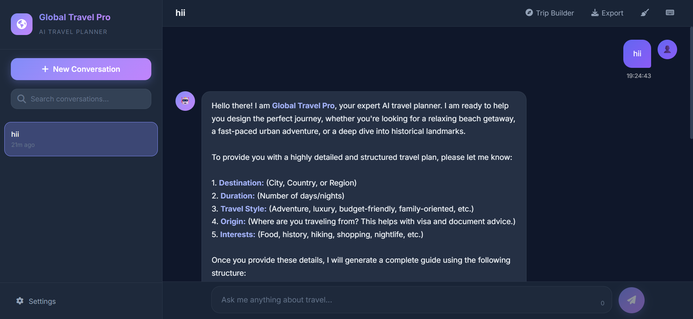
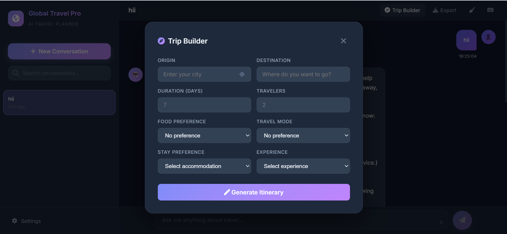
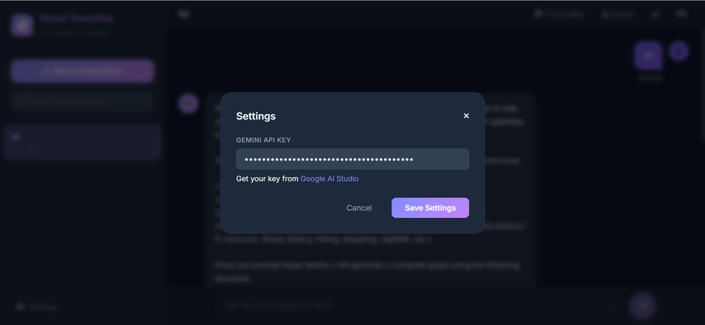

# 🌍 Global Travel Pro - AI Travel Planner

An intelligent travel planning chatbot powered by Google Gemini API. Get personalized itineraries, visa information, budget estimates, and expert travel tips in seconds.

## ✨ Features

- **AI-Powered Planning**: Ask anything about your travel plans and get detailed, structured responses
- **Conversation History**: Save and manage multiple conversations
- **Smart Formatting**: Beautiful Markdown-formatted travel plans with itineraries, budgets, and tips
- **Offline Settings**: Store your preferences locally in the browser
- **Export Functionality**: Download your travel plans for offline access

## 📸 Project Showcase

| | |
|---|---|
|  |  |
| **Welcome Screen** | **Chat Interface** |
|  |  |
| **Trip Builder** | **Settings Panel** |

## 🚀 Quick Start

1. Get your free Gemini API key from [Google AI Studio](https://aistudio.google.com/app/apikey)
2. Open the app and navigate to Settings
3. Paste your API key and start planning your trips!

## 🛠️ Tech Stack

- **Frontend**: Vanilla JavaScript (ES6+)
- **Styling**: CSS3 with Responsive Design
- **API**: Google Gemini API
- **Storage**: Browser LocalStorage

---

**Ready to plan your next adventure?** Start using Global Travel Pro today! ✈️
